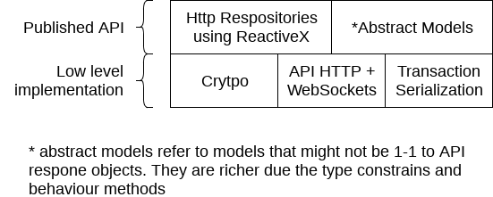

# SDK Development

:warning: **status**: draft

## Introduction

The SDKs for NEM2, aka Catapult, have a set of desired properties cross languages like:

- **Provide an abstraction layer of NEM2** handling the underlying complexity and providing an easy to use SDK.
- **Reduce code duplication** of NEM2 Libraries and Applications.
- **Shared design cross languages** enabling code portability from one platform to another faster and shared knowledge between NEM Developers
- **Be Lightweight**, focusing on the minimum features required to develop in NEM2.

In order to accomplish those properties, we share this guideline to help NEM Developer Community that wants to collaborate to match the best quality with the less effort in a collaborative way.

Remember to join our slack! Click [here][slack-invitation] to get an invitation.

## Starting point, being familiar with the current nem2-sdk & API

In case you haven't used nem2-sdk or Catapult in general, we encourage you to:

1. Review the technical documentation to become familiar with the concepts at https://nemtech.github.io/ .
2. Setup the [catapult in local environment via docker][docker] or enroll the [beta program][beta-program] to access a Catapult Test Net without need to run it yourself.
3. [Check the API reference][api-ref] and play with the API endpoints.
4. Become familiar with the current [nem2-sdk via code examples][sdk-guide] & [nem2-cli][cli].

## Architecture

## Development

There are two SDKs that can be used as guide, the [TypeScript][sdk-ts] & [Java][sdk-java] SDKs. The TypeScript version is the first SDK getting the latest updated, meanwhile Java takes longer to be updated. Unfortunately, TypeScript version has one specific implementation detail, the low level implementation is separated from the SDK, called [nem2-library-js][library-js]. The reason is due to the need of low level library to perform specific chain testing, **the other SDKs don't need the low level implementation be separated in another component**, so, similar to Java, it's included in the same SDK.

Regularly check the [Changelog](https://github.com/nemtech/nem2-sdk-java/blob/master/CHANGELOG.md) to be sure you didn't miss any code change update.

### Before creating the project

1. Be sure no one is already working on the SDK you want to create. Check the [repository list](summary.md), if someone is already working on it, we suggest you collaborate with him/her.
2. Claim the SDK [forking this repository](https://help.github.com/articles/creating-a-pull-request/) and adding a new entry to the [repository list](summary.md).
3. Consider using one of the suggested [licenses](#recommended-licenses).

### Creating the project

Consider:

1. Add a README with the instructions to install the SDK.
2. Add a [Code of Conduct](https://help.github.com/articles/adding-a-code-of-conduct-to-your-project/). [Here](https://github.com/nemtech/nem2-sdk-typescript-javascript/blob/master/CODE_OF_CONDUCT.md) some example.
3. Add a [Contributors guidelines](https://help.github.com/articles/setting-guidelines-for-repository-contributors/) to help others know how they can help you. [Here](https://github.com/nemtech/nem2-sdk-typescript-javascript/blob/master/CONTRIBUTING.md) some example.
4. Setup the Continuous Integration system. We use [travis-ci](https://travis-ci.org/), but feel free to use the one suits you best.

A project with a good test coverage it's more likely to be used and trusted by the developers! :smile:

We **strongly** suggest you to do [Test-Driven Development](https://en.wikipedia.org/wiki/Test-driven_development) or Unit-Testing (test last). If you need inspiration, you can copy the same [tests we did](https://github.com/nemtech/nem2-sdk-typescript-javascript/tree/master/test).

### API Wrapper

The API generation can be done with [Swagger Codegen](https://swagger.io/tools/swagger-codegen/). It supports multiple languages, hopefully yours in the list.

The API swagger file definition can be found [here][api-def].

[Java example](https://github.com/nemtech/nem2-sdk-java/tree/master/src/main/java/io/nem/sdk/infrastructure). The code generated by swagger are the `DTOs`.

We drop the client classes and instead we implement them using the [Repository pattern](https://martinfowler.com/eaaCatalog/repository.html) returning [Observables](https://en.wikipedia.org/wiki/Observer_pattern) of [ReactiveX](http://reactivex.io/).

List of interfaces:

- [AccountRepository](https://github.com/nemtech/nem2-sdk-java/blob/master/src/main/java/io/nem/sdk/infrastructure/AccountRepository.java)
- [BlockchainRepository](https://github.com/nemtech/nem2-sdk-java/blob/master/src/main/java/io/nem/sdk/infrastructure/BlockchainRepository.java)
- [MosaicRepository](https://github.com/nemtech/nem2-sdk-java/blob/master/src/main/java/io/nem/sdk/infrastructure/MosaicRepository.java)
- [NamespaceRepository](https://github.com/nemtech/nem2-sdk-java/blob/master/src/main/java/io/nem/sdk/infrastructure/NamespaceRepository.java)
- [NetworkRepository](https://github.com/nemtech/nem2-sdk-java/blob/master/src/main/java/io/nem/sdk/infrastructure/NetworkRepository.java)
- [TransferRepository](https://github.com/nemtech/nem2-sdk-java/blob/master/src/main/java/io/nem/sdk/infrastructure/TransactionRepository.java)

Check the [Http implementations](https://github.com/nemtech/nem2-sdk-java/blob/master/src/main/java/io/nem/sdk/infrastructure/AccountHttp.java) in case you doubt about some API endpoint.

:warning: The **repositories returns Models instead of DTOs**, you will need to do the [Models](#models) before finish the API wrapper.

### Models

[Java models example](https://github.com/nemtech/nem2-sdk-java/tree/master/src/main/java/io/nem/sdk/model).

The models are by default immutable, consider use the different tools that your language provides regarding immutability. The models aims to hide the complexity, like type conversion or relationship between objects. You will find in the different implementations different invariants to ensure the object is well constructed and a nicer API is published.

Strange things to consider:

- `uint64` support: meanwhile [Java supports big numbers](https://docs.oracle.com/javase/7/docs/api/java/math/BigInteger.html), for example JavaScript doesn't. So, JavaScript SDK has a custom class to handle the [`uint64` types](https://github.com/nemtech/nem2-sdk-typescript-javascript/blob/master/src/model/UInt64.ts). If your language supports `uint64` just use that implementation, in case your language doesn't support it, consider adapt the `UInt64.ts` implementation to your language.
- API conversions: The API returns the data sometimes compressed, you might need to convert that types for the user.
- [Mosaics](https://github.com/nemtech/nem2-sdk-java/blob/master/src/main/java/io/nem/sdk/model/mosaic/MosaicId.java) & [Namespaces](https://github.com/nemtech/nem2-sdk-java/blob/master/src/main/java/io/nem/sdk/model/namespace/NamespaceId.java) IDs: The Namespaces and Mosaics aren't strings any more compared to NEM1. As you can see in the class, the `string` name is optional. Since at creation time you add the string name, but when you receive the Namespace/Mosaic from network it comes in form of `uint64` ID. A specific endpoint returns the Namespace/Mosaic `string` name. We did a Service to return the Mosaic with the `string` name automatically for the user, check the implementation [here](https://github.com/nemtech/nem2-sdk-typescript-javascript/blob/master/src/service/MosaicService.ts) (just available in TypeScript SDK version).

### Transaction Serialization

TODO

### KeyPair and Cryptographic functions

TODO

## Pushing the code for review

TODO

## Publishing the SDK as official

TODO

## Future work

The current guideline just shows what's done up to today, since the SDK isn't complete, it will get updates according the latest architecture/features. If you started the development of an SDK, you will need to update the SDK with the latest updates.

## Recommended Licenses

- MIT: [Expat/MIT/X11 license](https://opensource.org/licenses/MIT)
- Apache-2.0: [Apache License, version 2.0](http://www.apache.org/licenses/LICENSE-2.0)
- BSD-2-Clause: [OSI-approved BSD 2-clause license](https://opensource.org/licenses/BSD-2-Clause)
- BSD-3-Clause: [OSI-approved BSD 3-clause license](https://opensource.org/licenses/BSD-3-Clause)
- CC0-1.0: [Creative Commons CC0 1.0 Universal](https://creativecommons.org/publicdomain/zero/1.0/)
- GNU-All-Permissive: [GNU All-Permissive License](http://www.gnu.org/prep/maintain/html_node/License-Notices-for-Other-Files.html)
- LGPL-2.1+: [GNU Lesser General Public License (LGPL), version 2.1 or newer](http://www.gnu.org/licenses/old-licenses/lgpl-2.1.en.html)

[sdk-ts]: https://github.com/nemtech/nem2-sdk-typescript-javascript
[sdk-java]: https://github.com/nemtech/nem2-sdk-java
[sdk-guide]: https://nemtech.github.io/guides/overview.html
[cli]: https://nemtech.github.io/cli/overview.html
[library-js]: https://github.com/nemtech/nem2-library-js
[api-ref]: https://nemtech.github.io/api/overview.html#reference-tools
[docker]: https://github.com/tech-bureau/catapult-service-bootstrap
[beta-program]: http://mijin.io/en/catapult
[slack-invitation]: https://join.slack.com/t/nem2/shared_invite/enQtMzY4MDc2NTg0ODgyLTFhZjgxM2NhYTQ1MTY1Mjk0ZDE2ZTJlYzUxYWYxYmJlYjAyY2EwNGM5NzgxMjM4MGEzMDc5ZDIwYTgzZjgyODM
[api-def]: https://github.com/nemtech/nem2-docs/blob/master/source/resources/collections/Catapult-REST-API-swagger.json